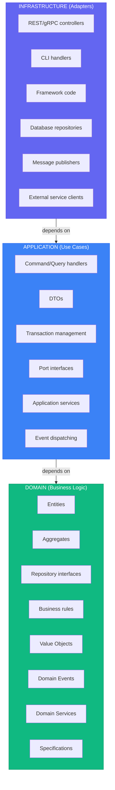
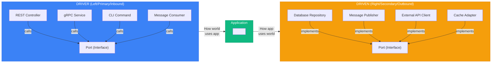

# Quick Reference Cheatsheet

> See [SKILL.md](../SKILL.md#sources) for full source list.

## Layer Summary



*Dependencies point inward*

---

## Quick Decision Trees

### "Where does this code go?"

```
Is it a business rule or constraint?
├── YES → Domain layer
└── NO ↓

Is it orchestrating a use case?
├── YES → Application layer
└── NO ↓

Is it dealing with external systems (DB, API, UI)?
├── YES → Infrastructure layer
└── NO → Reconsider; probably domain
```

### "Entity or Value Object?"

```
Does it have a unique identity that persists?
├── YES → Entity
└── NO ↓

Is it defined entirely by its attributes?
├── YES → Value Object
└── NO → Probably an Entity
```

### "Aggregate boundary?"

```
Must these objects change together atomically?
├── YES → Same aggregate
└── NO ↓

Can one exist without the other?
├── YES → Different aggregates (reference by ID)
└── NO → Probably same aggregate
```

### "Domain Service or Entity method?"

```
Does it naturally belong to one entity?
├── YES → Entity method
└── NO ↓

Does it require multiple aggregates?
├── YES → Domain Service
└── NO ↓

Is it stateless business logic?
├── YES → Domain Service
└── NO → Reconsider placement
```

---

## Common Patterns Quick Reference

### Value Object Template

```typescript
export class Money {
  private constructor(
    private readonly _amount: number,
    private readonly _currency: string,
  ) {}

  static create(amount: number, currency: string): Money {
    if (amount < 0) throw new Error('Negative');
    return new Money(amount, currency);
  }

  add(other: Money): Money {
    return Money.create(this._amount + other._amount, this._currency);
  }

  get amount(): number { return this._amount; }
  get currency(): string { return this._currency; }

  equals(other: Money): boolean {
    return this._amount === other._amount && this._currency === other._currency;
  }
}
```

### Entity Template

```typescript
export class OrderItem extends Entity<OrderItemId> {
  private _quantity: Quantity;

  private constructor(id: OrderItemId, private readonly _productId: ProductId, quantity: Quantity) {
    super(id);
    this._quantity = quantity;
  }

  static create(productId: ProductId, quantity: Quantity): OrderItem {
    return new OrderItem(OrderItemId.generate(), productId, quantity);
  }

  increaseQuantity(amount: number): void {
    this._quantity = this._quantity.add(amount);
  }

  get productId(): ProductId { return this._productId; }
  get quantity(): Quantity { return this._quantity; }
}
```

### Aggregate Root Template

```typescript
export class Order extends AggregateRoot<OrderId> {
  private _items: OrderItem[] = [];
  private _status: OrderStatus;

  private constructor(id: OrderId, customerId: CustomerId) {
    super(id);
    this._customerId = customerId;
    this._status = OrderStatus.Draft;
  }

  static create(customerId: CustomerId): Order {
    const order = new Order(OrderId.generate(), customerId);
    order.addDomainEvent(new OrderCreated(order.id, customerId));
    return order;
  }

  addItem(productId: ProductId, quantity: Quantity, price: Money): void {
    this.assertCanModify();
    this._items.push(OrderItem.create(productId, quantity, price));
  }

  confirm(): void {
    this.assertCanModify();
    if (this._items.length === 0) throw new EmptyOrderError();
    this._status = OrderStatus.Confirmed;
    this.addDomainEvent(new OrderConfirmed(this.id, this.total));
  }

  private assertCanModify(): void {
    if (this._status === OrderStatus.Cancelled) {
      throw new InvalidOrderStateError('Order is cancelled');
    }
  }

  get total(): Money { /* ... */ }
}
```

### Repository Interface Template

```typescript
export interface IOrderRepository {
  findById(id: OrderId): Promise<Order | null>;
  save(order: Order): Promise<void>;
  delete(order: Order): Promise<void>;
}
```

### Use Case Handler Template

```typescript
export class PlaceOrderHandler {
  constructor(
    private readonly orderRepo: IOrderRepository,
    private readonly productRepo: IProductRepository,
    private readonly eventPublisher: IEventPublisher,
  ) {}

  async execute(command: PlaceOrderCommand): Promise<OrderId> {
    const order = Order.create(CustomerId.from(command.customerId));

    for (const item of command.items) {
      const product = await this.productRepo.findById(item.productId);
      order.addItem(product.id, Quantity.create(item.quantity), product.price);
    }

    await this.orderRepo.save(order);
    await this.eventPublisher.publishAll(order.domainEvents);

    return order.id;
  }
}
```

---

## Port Naming Conventions

| Type | Pattern | Examples |
|------|---------|----------|
| Driver Port | `I{Action}UseCase` | `IPlaceOrderUseCase`, `IGetOrderUseCase` |
| Driven Port | `I{Resource}Repository` | `IOrderRepository`, `IProductRepository` |
| Driven Port | `I{Action}Service` | `IPaymentService`, `INotificationService` |
| Driven Port | `I{Resource}Gateway` | `IPaymentGateway`, `IShippingGateway` |

---

## Common Anti-Patterns

| Anti-Pattern | Problem | Solution |
|--------------|---------|----------|
| Anemic Domain | Entities are just data bags | Put behavior in entities |
| Repository per table | One repo per DB table | One repo per aggregate |
| Fat Use Cases | Business logic in handlers | Move to domain |
| Leaky Abstraction | Domain depends on ORM | Keep domain pure |
| God Aggregate | One massive aggregate | Split into smaller ones |
| Cross-Aggregate TX | Modifying multiple in one TX | Use domain events |
| Direct Layer Skip | Controller → Repository | Go through application layer |
| Premature CQRS | Adding complexity early | Start simple, evolve |
| Event Proliferation | Too many fine-grained events | May signal context boundary |

---

## Dependency Rules Matrix

|  | Domain | Application | Infrastructure |
|--|--------|-------------|----------------|
| **Domain** | ✅ | ❌ | ❌ |
| **Application** | ✅ | ✅ | ❌ |
| **Infrastructure** | ✅ | ✅ | ✅ |

✅ = Can depend on
❌ = Cannot depend on

---

## Hexagonal Quick Reference



---

## When to Use / Skip

### Use Clean + DDD + Hexagonal When:

- ✅ Complex business domain with many rules
- ✅ Long-lived system (years of maintenance)
- ✅ Large team (5+ developers)
- ✅ Need to swap infrastructure (DB, broker, etc.)
- ✅ High test coverage required
- ✅ Multiple entry points (API, CLI, events, scheduled jobs)

### Skip When:

- ❌ Simple CRUD application (most applications)
- ❌ Prototype / MVP / throwaway code
- ❌ Small team (1-2 devs)
- ❌ Short-lived project
- ❌ Trivial business logic

### Complexity Ladder (Start Simple)

```
Level 1: Simple layered (Controller → Service → Repository)
   ↓ When business rules grow complex
Level 2: Domain model (Entities with behavior)
   ↓ When need multiple entry points
Level 3: Hexagonal (Ports & Adapters)
   ↓ When read/write patterns diverge significantly
Level 4: CQRS (Separate read/write models)
   ↓ When need complete audit trail / temporal queries
Level 5: Event Sourcing (Store events, derive state)
```

**Don't skip levels.** Each level adds complexity. Move up only when you've proven the current level insufficient.

---

## File Naming Conventions

```
domain/
├── order/
│   ├── order.ts                    # Aggregate root
│   ├── order_item.ts               # Entity
│   ├── value_objects.ts            # OrderId, Money, etc.
│   ├── events.ts                   # OrderCreated, etc.
│   ├── repository.ts               # IOrderRepository
│   ├── services.ts                 # Domain services
│   └── errors.ts                   # OrderError, etc.

application/
├── place_order/
│   ├── command.ts                  # PlaceOrderCommand
│   ├── handler.ts                  # PlaceOrderHandler
│   └── port.ts                     # IPlaceOrderUseCase

infrastructure/
├── postgres/
│   ├── order_repository.ts         # PostgresOrderRepository
│   └── mappers/
│       └── order_mapper.ts         # Domain <-> DB mapping
```

---

## Resources

### Books
- Clean Architecture (Robert C. Martin, 2017)
- Domain-Driven Design (Eric Evans, 2003)
- Implementing Domain-Driven Design (Vaughn Vernon, 2013)
- Hexagonal Architecture Explained (Alistair Cockburn, 2024)
- Get Your Hands Dirty on Clean Architecture (Tom Hombergs, 2019)

### Reference Implementations
- Go: [bxcodec/go-clean-arch](https://github.com/bxcodec/go-clean-arch)
- Rust: [flosse/clean-architecture-with-rust](https://github.com/flosse/clean-architecture-with-rust)
- Python: [cdddg/py-clean-arch](https://github.com/cdddg/py-clean-arch)
- TypeScript: [jbuget/nodejs-clean-architecture-app](https://github.com/jbuget/nodejs-clean-architecture-app)
- .NET: [jasontaylordev/CleanArchitecture](https://github.com/jasontaylordev/CleanArchitecture)
- Java: [thombergs/buckpal](https://github.com/thombergs/buckpal)

### Official Documentation
- https://blog.cleancoder.com/uncle-bob/2012/08/13/the-clean-architecture.html
- https://alistair.cockburn.us/hexagonal-architecture/
- https://www.domainlanguage.com/ddd/
- https://martinfowler.com/tags/domain%20driven%20design.html
