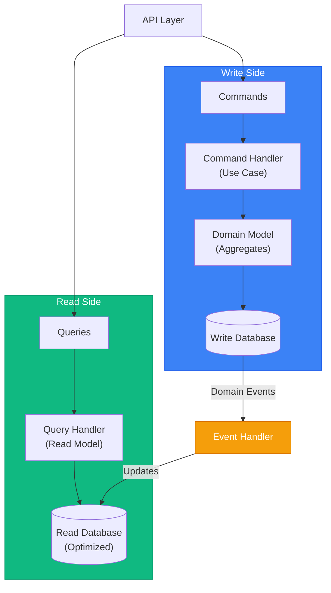

# CQRS & Domain Events

> Sources:
> - [CQRS](https://martinfowler.com/bliki/CQRS.html) — Martin Fowler
> - [Event Sourcing](https://martinfowler.com/eaaDev/EventSourcing.html) — Martin Fowler
> - [CQRS Pattern](https://learn.microsoft.com/en-us/azure/architecture/patterns/cqrs) — Microsoft Azure
> - [Transactional Outbox](https://microservices.io/patterns/data/transactional-outbox.html) — microservices.io
> - [Domain Events – Salvation](https://udidahan.com/2009/06/14/domain-events-salvation/) — Udi Dahan
> - [Strengthening Your Domain: Domain Events](https://lostechies.com/jimmybogard/2010/04/08/strengthening-your-domain-domain-events/) — Jimmy Bogard
> - [Domain Events: Design and Implementation](https://learn.microsoft.com/en-us/dotnet/architecture/microservices/microservice-ddd-cqrs-patterns/domain-events-design-implementation) — Microsoft

## CQRS Overview

**Command Query Responsibility Segregation** separates read and write operations into different models.



---

## Commands vs Queries

### Commands (Write Side)

Commands represent intent to change state. They **mutate** data.

```typescript
// application/commands/place_order_command.ts
export interface PlaceOrderCommand {
  type: 'PlaceOrder';
  customerId: string;
  items: Array<{
    productId: string;
    quantity: number;
  }>;
}

export interface ConfirmOrderCommand {
  type: 'ConfirmOrder';
  orderId: string;
}

export interface CancelOrderCommand {
  type: 'CancelOrder';
  orderId: string;
  reason: string;
}

export class PlaceOrderHandler {
  async handle(command: PlaceOrderCommand): Promise<OrderId> {
    const order = Order.create(CustomerId.from(command.customerId));

    for (const item of command.items) {
      const product = await this.productRepo.findById(item.productId);
      order.addItem(product.id, item.quantity, product.price);
    }

    await this.orderRepo.save(order);
    await this.eventPublisher.publishAll(order.domainEvents);

    return order.id;
  }
}
```

### Queries (Read Side)

Queries retrieve data without side effects. They **never mutate** state.

```typescript
// application/queries/get_order_query.ts
export interface GetOrderQuery {
  orderId: string;
}

export interface GetOrdersByCustomerQuery {
  customerId: string;
  status?: OrderStatus;
  page?: number;
  pageSize?: number;
}

export interface OrderDTO {
  id: string;
  customerId: string;
  customerName: string;
  status: string;
  items: Array<{
    productId: string;
    productName: string;
    quantity: number;
    unitPrice: number;
    subtotal: number;
  }>;
  total: number;
  createdAt: string;
  confirmedAt?: string;
}

export class GetOrderHandler {
  constructor(private readonly readDb: IOrderReadModel) {}

  async handle(query: GetOrderQuery): Promise<OrderDTO | null> {
    return this.readDb.findById(query.orderId);
  }
}

export class GetOrdersByCustomerHandler {
  constructor(private readonly readDb: IOrderReadModel) {}

  async handle(query: GetOrdersByCustomerQuery): Promise<PaginatedResult<OrderDTO>> {
    return this.readDb.findByCustomer(
      query.customerId,
      query.status,
      query.page ?? 1,
      query.pageSize ?? 20
    );
  }
}
```

---

## Read Model (Projection)

Optimized database structure for queries. Can denormalize data for performance.

```
interface IOrderReadModel:
    findById(orderId: string) -> OrderDTO | null
    findByCustomer(customerId, status?, page?, pageSize?) -> PaginatedResult<OrderDTO>
    search(criteria: OrderSearchCriteria) -> List<OrderDTO>

class PostgresOrderReadModel implements IOrderReadModel:
    db: Database

    findById(orderId: string) -> OrderDTO | null:
        row = db.ordersRead
            .where(id: orderId)
            .join("customer")
            .withRelated("items.product")
            .first()

        return row ? this.mapToDTO(row) : null
```

Separate write and read databases (optional): write is normalized for transactions, read is denormalized for queries.

---

## Domain Events

Notifications that something happened in the domain. Used for:
- Updating read models
- Cross-aggregate communication
- Integration with other bounded contexts

### Event Structure

```typescript
// domain/shared/domain_event.ts
export abstract class DomainEvent {
  readonly eventId: string;
  readonly occurredAt: Date;
  readonly aggregateId: string;
  abstract readonly eventType: string;

  constructor(aggregateId: string) {
    this.eventId = crypto.randomUUID();
    this.occurredAt = new Date();
    this.aggregateId = aggregateId;
  }

  abstract toPayload(): Record<string, unknown>;
}

// domain/order/events.ts
export class OrderCreated extends DomainEvent {
  readonly eventType = 'order.created';

  constructor(
    readonly orderId: OrderId,
    readonly customerId: CustomerId,
  ) {
    super(orderId.value);
  }

  toPayload() {
    return {
      orderId: this.orderId.value,
      customerId: this.customerId.value,
    };
  }
}

export class OrderConfirmed extends DomainEvent {
  readonly eventType = 'order.confirmed';

  constructor(
    readonly orderId: OrderId,
    readonly total: Money,
    readonly items: ReadonlyArray<{ productId: string; quantity: number }>,
  ) {
    super(orderId.value);
  }

  toPayload() {
    return {
      orderId: this.orderId.value,
      total: { amount: this.total.amount, currency: this.total.currency },
      items: this.items,
    };
  }
}

export class OrderShipped extends DomainEvent {
  readonly eventType = 'order.shipped';

  constructor(
    readonly orderId: OrderId,
    readonly trackingNumber: string,
    readonly carrier: string,
  ) {
    super(orderId.value);
  }

  toPayload() {
    return {
      orderId: this.orderId.value,
      trackingNumber: this.trackingNumber,
      carrier: this.carrier,
    };
  }
}
```

### Event Handlers

```
class OrderCreatedHandler:
    db: Database

    handle(event: OrderCreated):
        db.ordersRead.insert({
            id: event.orderId.value,
            customerId: event.customerId.value,
            status: "draft",
            createdAt: event.occurredAt
        })

class OrderConfirmedHandler:
    db: Database

    handle(event: OrderConfirmed):
        db.ordersRead
            .where(id: event.orderId.value)
            .update({
                status: "confirmed",
                total: event.total.amount,
                confirmedAt: event.occurredAt
            })

export class SendShippingNotificationHandler {
  constructor(
    private readonly orderRepo: IOrderRepository,
    private readonly notifier: INotificationService,
  ) {}

  async handle(event: OrderShipped): Promise<void> {
    const order = await this.orderRepo.findById(OrderId.from(event.orderId.value));
    if (!order) return;

    await this.notifier.sendEmail(order.customerEmail, {
      template: 'order-shipped',
      data: {
        orderId: event.orderId.value,
        trackingNumber: event.trackingNumber,
        carrier: event.carrier,
      },
    });
  }
}
```

---

## Domain Events vs Integration Events

### Domain Events

- Stay within bounded context
- Fine-grained, low-level
- Trigger internal processes
- Named in domain language

```typescript
class OrderItemQuantityIncreased extends DomainEvent {
  constructor(
    readonly orderId: OrderId,
    readonly productId: ProductId,
    readonly oldQuantity: number,
    readonly newQuantity: number,
  ) { super(orderId.value); }
}
```

### Integration Events

- Cross bounded context boundaries
- Coarser-grained
- Published to message broker
- Versioned schema

```typescript
interface OrderConfirmedIntegrationEvent {
  eventType: 'sales.order.confirmed';
  eventId: string;
  version: '1.0';
  occurredAt: string;
  payload: {
    orderId: string;
    customerId: string;
    total: { amount: number; currency: string };
    items: Array<{
      productId: string;
      quantity: number;
      unitPrice: number;
    }>;
    shippingAddress: {
      street: string;
      city: string;
      postalCode: string;
      country: string;
    };
  };
}
```

### Publishing Integration Events

```typescript
// application/event_handlers/publish_integration_events.ts
export class PublishOrderConfirmedIntegrationEvent {
  constructor(
    private readonly messageBroker: IMessageBroker,
    private readonly orderRepo: IOrderRepository,
  ) {}

  async handle(domainEvent: OrderConfirmed): Promise<void> {
    const order = await this.orderRepo.findById(domainEvent.orderId);
    if (!order) return;

    const integrationEvent: OrderConfirmedIntegrationEvent = {
      eventType: 'sales.order.confirmed',
      eventId: crypto.randomUUID(),
      version: '1.0',
      occurredAt: new Date().toISOString(),
      payload: {
        orderId: order.id.value,
        customerId: order.customerId.value,
        total: {
          amount: order.total.amount,
          currency: order.total.currency,
        },
        items: order.items.map(item => ({
          productId: item.productId.value,
          quantity: item.quantity.value,
          unitPrice: item.unitPrice.amount,
        })),
        shippingAddress: order.shippingAddress
          ? {
              street: order.shippingAddress.street,
              city: order.shippingAddress.city,
              postalCode: order.shippingAddress.postalCode,
              country: order.shippingAddress.country,
            }
          : null,
      },
    };

    await this.messageBroker.publish('order-events', integrationEvent);
  }
}
```

---

## Event Dispatcher Pattern

```typescript
// infrastructure/events/event_dispatcher.ts
export interface IEventHandler<T extends DomainEvent> {
  handle(event: T): Promise<void>;
}

export class EventDispatcher {
  private handlers: Map<string, IEventHandler<any>[]> = new Map();

  register<T extends DomainEvent>(
    eventType: string,
    handler: IEventHandler<T>,
  ): void {
    const existing = this.handlers.get(eventType) ?? [];
    existing.push(handler);
    this.handlers.set(eventType, existing);
  }

  async dispatch(event: DomainEvent): Promise<void> {
    const handlers = this.handlers.get(event.eventType) ?? [];
    await Promise.all(handlers.map(h => h.handle(event)));
  }

  async dispatchAll(events: DomainEvent[]): Promise<void> {
    for (const event of events) {
      await this.dispatch(event);
    }
  }
}

const dispatcher = new EventDispatcher();
dispatcher.register('order.created', new OrderCreatedHandler(readDb));
dispatcher.register('order.confirmed', new OrderConfirmedHandler(readDb));
dispatcher.register('order.confirmed', new PublishOrderConfirmedIntegrationEvent(broker, orderRepo));
dispatcher.register('order.shipped', new SendShippingNotificationHandler(orderRepo, notifier));
```

---

## Outbox Pattern

Ensures events are published reliably (exactly-once semantics).

```
interface OutboxMessage:
    id: string
    eventType: string
    payload: string
    createdAt: DateTime
    processedAt: DateTime | null

class OutboxRepository:
    db: Database

    save(event: DomainEvent, tx: Transaction):
        tx.outbox.insert({
            id: event.eventId,
            eventType: event.eventType,
            payload: serialize(event.toPayload()),
            createdAt: event.occurredAt
        })

    getUnprocessed(limit: int = 100) -> List<OutboxMessage>:
        return db.outbox
            .where(processedAt: null)
            .orderBy("createdAt")
            .limit(limit)
            .lockForUpdate()

    markProcessed(id: string):
        db.outbox.where(id: id).update({processedAt: now()})

class PlaceOrderHandler:
    orderRepo: IOrderRepository
    outbox: OutboxRepository
    db: Database

    handle(command: PlaceOrderCommand) -> OrderId:
        order = Order.create(CustomerId.from(command.customerId))

        db.transaction((tx) => {
            orderRepo.save(order, tx)
            for event in order.domainEvents:
                outbox.save(event, tx)
        })

        return order.id

class OutboxProcessor:
    outbox: OutboxRepository
    messageBroker: IMessageBroker

    process():
        messages = outbox.getUnprocessed()

        for message in messages:
            try:
                messageBroker.publish(message.eventType, message.payload)
                outbox.markProcessed(message.id)
            catch error:
                log.error("Failed to process outbox message", message.id)
```

---

## When to Use CQRS

> **Warning:** "You should be very cautious about using CQRS... the majority of cases I've run into have not been so good." — Martin Fowler

CQRS adds significant complexity. Most applications don't need it.

### Use CQRS When:

- Read and write workloads have **dramatically** different scaling requirements
- Complex queries that genuinely don't map well to domain model
- Different teams work on read vs write sides
- Event sourcing is used (CQRS pairs naturally with ES)
- You've proven simpler approaches are insufficient

### Skip CQRS When:

- Simple CRUD application (most applications)
- Read/write patterns are similar
- Small team, simple domain
- You haven't tried a simple reporting database first
- Adding it "just in case"

**CQRS applies to specific bounded contexts, never entire systems.**

### Simplified CQRS (Start Here)

Start simple—same database, different query paths:

```typescript
class OrderService {
  async placeOrder(cmd: PlaceOrderCommand): Promise<OrderId> {
    const order = Order.create(...);
    await this.orderRepo.save(order);
    return order.id;
  }

  async getOrder(id: string): Promise<OrderDTO | null> {
    return this.readModel.findById(id);
  }
}
```

Evolve to separate databases only when needed.

---

## Event Sourcing: Critical Considerations

> **Warning:** "Extremely difficult to add Event Sourcing to systems not originally designed for it." — Martin Fowler

### When Event Sourcing Makes Sense

- Complete audit trail is a business requirement
- Need to reconstruct state at any point in time
- Domain is inherently event-driven (financial transactions, workflows)
- Debugging requires understanding "how did we get here?"

### When to Avoid Event Sourcing

- Simple CRUD with no audit requirements
- Team unfamiliar with event-driven patterns
- Adding it retroactively to existing system
- No clear business need for temporal queries

### Event Sourcing Requirements

1. **Events must store deltas** — Not final state, but what changed (enables reversal)
2. **Snapshots for performance** — Rebuild from snapshots, not from event 0
3. **External system handling:**
   - Disable notifications during replays
   - Cache external query results with timestamps
4. **Schema evolution strategy** — Events are forever; plan for versioning

---

## Saga Pattern (Cross-Aggregate Workflows)

For workflows spanning multiple aggregates, use sagas instead of trying to coordinate via raw domain events.

```
Saga: PlaceOrderSaga
├── Step 1: Reserve inventory (Inventory aggregate)
├── Step 2: Process payment (Payment aggregate)
├── Step 3: Confirm order (Order aggregate)
└── Compensating actions if any step fails
```

**Saga types:**
- **Choreography:** Each service listens/publishes events (simpler, harder to trace)
- **Orchestration:** Central coordinator manages steps (explicit, easier to debug)

---

## Idempotent Consumer Pattern

**Required for reliable event processing.** Messages may be delivered more than once.

```
class OrderConfirmedHandler:
    processedIds: Set<string>

    handle(event: OrderConfirmed):
        if event.eventId in processedIds:
            return

        doWork(event)
        processedIds.add(event.eventId)
```

**Implementation options:**
- Store processed message IDs in database
- Use message broker's deduplication features
- Design handlers to be naturally idempotent
