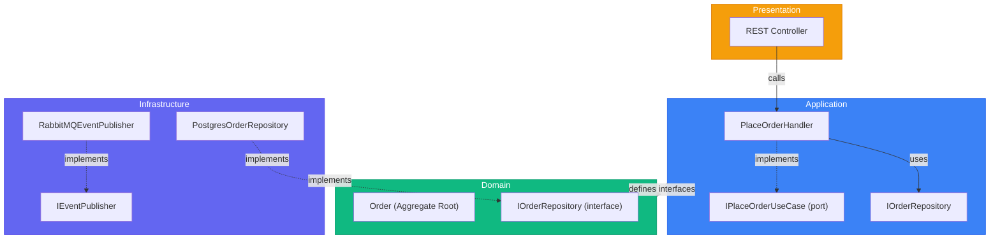

# Layer Structure - Complete Reference

> Sources:
> - [The Clean Architecture](https://blog.cleancoder.com/uncle-bob/2012/08/13/the-clean-architecture.html) — Robert C. Martin
> - [Designing a DDD-oriented Microservice](https://learn.microsoft.com/en-us/dotnet/architecture/microservices/microservice-ddd-cqrs-patterns/ddd-oriented-microservice) — Microsoft
> - [Clean Architecture: Standing on the Shoulders of Giants](https://herbertograca.com/2017/09/28/clean-architecture-standing-on-the-shoulders-of-giants/) — Herberto Graça

## The Four Layers

| Layer | Responsibility | Dependencies |
|-------|---------------|--------------|
| **Domain** | Business logic, entities, rules | None (pure) |
| **Application** | Use cases, orchestration | Domain |
| **Infrastructure** | External systems, frameworks | Application, Domain |
| **Presentation** | API/UI entry points | Application |

---

## Domain Layer (Innermost)

The **heart of the system**. Contains business logic and rules with **zero external dependencies**.

### Contents

```
domain/
├── order/                      # Aggregate folder
│   ├── order.ts                # Aggregate root entity
│   ├── order_item.ts           # Child entity
│   ├── value_objects.ts        # Money, Address, OrderStatus
│   ├── events.ts               # OrderPlaced, OrderShipped
│   ├── repository.ts           # IOrderRepository interface
│   ├── services.ts             # PricingService, DiscountService
│   └── errors.ts               # InsufficientStockError
├── customer/
│   └── ...
├── product/
│   └── ...
└── shared/
    ├── entity.ts               # Base Entity class
    ├── aggregate_root.ts       # Base AggregateRoot class
    ├── value_object.ts         # Base ValueObject class
    ├── domain_event.ts         # Base DomainEvent class
    └── errors.ts               # DomainError base
```

### Rules

1. **No framework imports** - No ORM decorators, no HTTP libraries
2. **No infrastructure concerns** - No database, no message queues
3. **Pure business logic** - Only language primitives and domain types
4. **Rich behavior** - Methods that enforce business rules

### Example: Domain Entity

```typescript
// domain/order/order.ts
import { AggregateRoot } from '../shared/aggregate_root';
import { OrderItem } from './order_item';
import { Money } from './value_objects';
import { OrderPlaced, OrderShipped } from './events';
import { InsufficientStockError } from './errors';

export class Order extends AggregateRoot<OrderId> {
  private items: OrderItem[] = [];
  private status: OrderStatus;

  private constructor(id: OrderId, customerId: CustomerId) {
    super(id);
    this.customerId = customerId;
    this.status = OrderStatus.Draft;
  }

  static create(id: OrderId, customerId: CustomerId): Order {
    const order = new Order(id, customerId);
    order.addDomainEvent(new OrderPlaced(id, customerId));
    return order;
  }

  addItem(product: Product, quantity: number): void {
    if (quantity <= 0) {
      throw new InvalidQuantityError(quantity);
    }
    if (!product.hasStock(quantity)) {
      throw new InsufficientStockError(product.id, quantity);
    }

    const existingItem = this.items.find(i => i.productId.equals(product.id));
    if (existingItem) {
      existingItem.increaseQuantity(quantity);
    } else {
      this.items.push(OrderItem.create(product.id, product.price, quantity));
    }
  }

  ship(): void {
    if (this.status !== OrderStatus.Confirmed) {
      throw new InvalidOrderStateError('Cannot ship unconfirmed order');
    }
    this.status = OrderStatus.Shipped;
    this.addDomainEvent(new OrderShipped(this.id));
  }

  get total(): Money {
    return this.items.reduce(
      (sum, item) => sum.add(item.subtotal),
      Money.zero()
    );
  }
}
```

---

## Application Layer

Orchestrates use cases by coordinating domain objects. Contains **application-specific business rules**.

### Contents

```
application/
├── orders/
│   ├── place_order/
│   │   ├── command.ts          # PlaceOrderCommand DTO
│   │   ├── handler.ts          # PlaceOrderHandler
│   │   └── port.ts             # IPlaceOrderUseCase interface
│   ├── ship_order/
│   │   └── ...
│   └── get_order/
│       ├── query.ts            # GetOrderQuery DTO
│       ├── handler.ts          # GetOrderHandler
│       └── result.ts           # OrderDTO response
├── shared/
│   ├── unit_of_work.ts         # IUnitOfWork interface
│   ├── event_publisher.ts      # IEventPublisher interface
│   └── errors.ts               # ApplicationError base
└── index.ts                    # Public API exports
```

### Rules

1. **Depends only on Domain** - No infrastructure imports
2. **Defines ports** - Interfaces for repositories, external services
3. **Orchestrates, doesn't implement** - Calls domain methods
4. **Transaction boundary** - Manages unit of work

### Example: Use Case Handler

```typescript
// application/orders/place_order/handler.ts
import { Order } from '@/domain/order/order';
import { IOrderRepository } from '@/domain/order/repository';
import { IProductRepository } from '@/domain/product/repository';
import { IUnitOfWork } from '@/application/shared/unit_of_work';
import { IEventPublisher } from '@/application/shared/event_publisher';
import { PlaceOrderCommand } from './command';
import { OrderNotFoundError, ProductNotFoundError } from '@/application/shared/errors';

export interface IPlaceOrderUseCase {
  execute(command: PlaceOrderCommand): Promise<OrderId>;
}

export class PlaceOrderHandler implements IPlaceOrderUseCase {
  constructor(
    private readonly orderRepo: IOrderRepository,
    private readonly productRepo: IProductRepository,
    private readonly uow: IUnitOfWork,
    private readonly eventPublisher: IEventPublisher,
  ) {}

  async execute(command: PlaceOrderCommand): Promise<OrderId> {
    await this.uow.begin();

    try {
      const orderId = OrderId.generate();
      const order = Order.create(orderId, command.customerId);

      for (const item of command.items) {
        const product = await this.productRepo.findById(item.productId);
        if (!product) {
          throw new ProductNotFoundError(item.productId);
        }
        order.addItem(product, item.quantity);
      }

      await this.orderRepo.save(order);
      await this.uow.commit();
      await this.eventPublisher.publishAll(order.domainEvents);

      return orderId;
    } catch (error) {
      await this.uow.rollback();
      throw error;
    }
  }
}
```

### Command/Query DTOs

```typescript
// application/orders/place_order/command.ts
export interface PlaceOrderCommand {
  customerId: string;
  items: Array<{
    productId: string;
    quantity: number;
  }>;
}

// application/orders/get_order/query.ts
export interface GetOrderQuery {
  orderId: string;
}

// application/orders/get_order/result.ts
export interface OrderDTO {
  id: string;
  customerId: string;
  status: string;
  items: Array<{
    productId: string;
    productName: string;
    quantity: number;
    unitPrice: number;
    subtotal: number;
  }>;
  total: number;
  createdAt: string;
}
```

---

## Infrastructure Layer

Implements interfaces defined in Domain and Application layers. Contains **all external concerns**.

### Contents

```
infrastructure/
├── persistence/
│   ├── postgres/
│   │   ├── order_repository.ts      # PostgresOrderRepository
│   │   ├── product_repository.ts
│   │   ├── unit_of_work.ts          # PostgresUnitOfWork
│   │   ├── migrations/
│   │   └── mappers/
│   │       └── order_mapper.ts      # Domain <-> DB mapping
│   └── in_memory/
│       ├── order_repository.ts      # InMemoryOrderRepository (tests)
│       └── unit_of_work.ts
├── messaging/
│   ├── rabbitmq/
│   │   └── event_publisher.ts       # RabbitMQEventPublisher
│   └── in_memory/
│       └── event_publisher.ts       # InMemoryEventPublisher (tests)
├── external/
│   ├── payment/
│   │   └── stripe_gateway.ts        # StripePaymentGateway
│   └── shipping/
│       └── fedex_service.ts         # FedExShippingService
├── http/
│   ├── rest/
│   │   ├── controllers/
│   │   │   └── order_controller.ts  # REST API adapter
│   │   ├── middleware/
│   │   └── routes.ts
│   └── graphql/
│       └── resolvers/
├── grpc/
│   └── order_service.ts             # gRPC adapter
└── config/
    ├── container.ts                 # DI container setup
    └── env.ts                       # Environment config
```

### Rules

1. **Implements ports** - Concrete classes for interfaces
2. **Contains framework code** - ORM, HTTP frameworks, etc.
3. **Maps between layers** - Domain ↔ Database/DTO mapping
4. **Easily replaceable** - Can swap Postgres for MongoDB

### Example: Repository Implementation

```
class PostgresOrderRepository implements IOrderRepository:
    db: Database

    findById(id: OrderId) -> Order | null:
        row = db.orders
            .where(id: id.value)
            .withRelated("items")
            .first()

        if not row:
            return null

        return OrderMapper.toDomain(row)

    save(order: Order):
        data = OrderMapper.toPersistence(order)
        db.orders.upsert(data)

    delete(order: Order):
        db.orders.where(id: order.id.value).delete()
```

---

## Presentation Layer

Entry points to the application. Adapts external requests to application commands/queries.

### Contents

```
presentation/
├── rest/
│   ├── controllers/
│   │   ├── order_controller.ts
│   │   └── product_controller.ts
│   ├── middleware/
│   │   ├── auth.ts
│   │   ├── error_handler.ts
│   │   └── validation.ts
│   ├── dto/
│   │   ├── requests/
│   │   └── responses/
│   └── routes.ts
├── grpc/
│   └── ...
├── graphql/
│   └── ...
└── cli/
    └── ...
```

### Example: REST Controller

```typescript
// presentation/rest/controllers/order_controller.ts
import { Request, Response, NextFunction } from 'express';
import { IPlaceOrderUseCase } from '@/application/orders/place_order/port';
import { IGetOrderUseCase } from '@/application/orders/get_order/port';
import { PlaceOrderRequest } from '../dto/requests/place_order_request';

export class OrderController {
  constructor(
    private readonly placeOrder: IPlaceOrderUseCase,
    private readonly getOrder: IGetOrderUseCase,
  ) {}

  async create(req: Request, res: Response, next: NextFunction): Promise<void> {
    try {
      const request = req.body as PlaceOrderRequest;

      const orderId = await this.placeOrder.execute({
        customerId: req.user.id,
        items: request.items.map(item => ({
          productId: item.product_id,
          quantity: item.quantity,
        })),
      });

      res.status(201).json({ id: orderId.value });
    } catch (error) {
      next(error);
    }
  }

  async show(req: Request, res: Response, next: NextFunction): Promise<void> {
    try {
      const order = await this.getOrder.execute({ orderId: req.params.id });

      if (!order) {
        res.status(404).json({ error: 'Order not found' });
        return;
      }

      res.json(order);
    } catch (error) {
      next(error);
    }
  }
}
```

---

## Dependency Flow



---

## Composition Root

All dependencies are wired together at the application entry point.

```typescript
import { Pool } from 'pg';
import { Container } from 'inversify';
import { IOrderRepository } from '@/domain/order/repository';
import { IProductRepository } from '@/domain/product/repository';
import { IPlaceOrderUseCase } from '@/application/orders/place_order/port';
import { IUnitOfWork } from '@/application/shared/unit_of_work';
import { IEventPublisher } from '@/application/shared/event_publisher';
import { PlaceOrderHandler } from '@/application/orders/place_order/handler';
import { PostgresOrderRepository } from '@/infrastructure/persistence/postgres/order_repository';
import { PostgresProductRepository } from '@/infrastructure/persistence/postgres/product_repository';
import { PostgresUnitOfWork } from '@/infrastructure/persistence/postgres/unit_of_work';
import { RabbitMQEventPublisher } from '@/infrastructure/messaging/rabbitmq/event_publisher';
import { OrderController } from '@/presentation/rest/controllers/order_controller';

export function configureContainer(): Container {
  const container = new Container();
  const pool = new Pool({ connectionString: process.env.DATABASE_URL });

  container.bind<Pool>('Pool').toConstantValue(pool);
  container.bind<IOrderRepository>('IOrderRepository').to(PostgresOrderRepository);
  container.bind<IProductRepository>('IProductRepository').to(PostgresProductRepository);
  container.bind<IUnitOfWork>('IUnitOfWork').to(PostgresUnitOfWork);
  container.bind<IEventPublisher>('IEventPublisher').to(RabbitMQEventPublisher);
  container.bind<IPlaceOrderUseCase>('IPlaceOrderUseCase').to(PlaceOrderHandler);
  container.bind<OrderController>(OrderController).toSelf();

  return container;
}
```

---

## Language-Agnostic Structure

The same layered structure applies to any language:

### Go
```
internal/
├── domain/
├── application/
├── infrastructure/
└── interfaces/      # Presentation
```

### Rust
```
src/
├── domain/
├── application/
├── infrastructure/
└── presentation/
```

### Python
```
src/
├── domain/
├── application/
├── infrastructure/
└── presentation/
```

The key is **dependency direction**: outer layers import inner layers, never the reverse.
