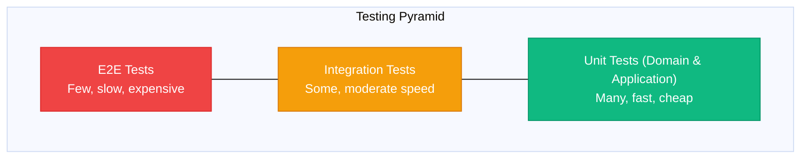

# Testing Patterns

> Sources:
> - [The Clean Architecture](https://blog.cleancoder.com/uncle-bob/2012/08/13/the-clean-architecture.html) — Robert C. Martin
> - [Hexagonal Architecture](https://alistair.cockburn.us/hexagonal-architecture/) — Alistair Cockburn
> - [Unit Testing](https://martinfowler.com/bliki/UnitTest.html) — Martin Fowler
> - [Test Pyramid](https://martinfowler.com/bliki/TestPyramid.html) — Martin Fowler

Testing strategies for Clean Architecture + DDD + Hexagonal systems.

## Testing Pyramid



---

## Unit Tests

### Domain Layer Tests

Test business logic in isolation. **No mocks needed**—domain has no dependencies.

```typescript
// tests/domain/order/order.test.ts
describe('Order', () => {
  describe('create', () => {
    it('creates order with draft status', () => {
      const customerId = CustomerId.from('cust-123');

      const order = Order.create(customerId);

      expect(order.status).toBe(OrderStatus.Draft);
      expect(order.customerId).toEqual(customerId);
      expect(order.items).toHaveLength(0);
    });

    it('emits OrderCreated event', () => {
      const customerId = CustomerId.from('cust-123');

      const order = Order.create(customerId);

      expect(order.domainEvents).toHaveLength(1);
      expect(order.domainEvents[0]).toBeInstanceOf(OrderCreated);
    });
  });

  describe('addItem', () => {
    it('adds item to order', () => {
      const order = createDraftOrder();
      const productId = ProductId.from('prod-123');
      const quantity = Quantity.create(2);
      const price = Money.create(10.00, 'USD');

      order.addItem(productId, quantity, price);

      expect(order.items).toHaveLength(1);
      expect(order.items[0].productId).toEqual(productId);
      expect(order.items[0].quantity).toEqual(quantity);
    });

    it('increases quantity for existing product', () => {
      const order = createDraftOrder();
      const productId = ProductId.from('prod-123');
      const price = Money.create(10.00, 'USD');

      order.addItem(productId, Quantity.create(2), price);
      order.addItem(productId, Quantity.create(3), price);

      expect(order.items).toHaveLength(1);
      expect(order.items[0].quantity.value).toBe(5);
    });

    it('throws when order is cancelled', () => {
      const order = createCancelledOrder();

      expect(() => {
        order.addItem(ProductId.from('prod-123'), Quantity.create(1), Money.create(10, 'USD'));
      }).toThrow(InvalidOrderStateError);
    });

    it('throws when quantity is zero', () => {
      const order = createDraftOrder();

      expect(() => {
        order.addItem(ProductId.from('prod-123'), Quantity.create(0), Money.create(10, 'USD'));
      }).toThrow(InvalidQuantityError);
    });
  });

  describe('confirm', () => {
    it('changes status to confirmed', () => {
      const order = createOrderWithItems();

      order.confirm();

      expect(order.status).toBe(OrderStatus.Confirmed);
    });

    it('emits OrderConfirmed event', () => {
      const order = createOrderWithItems();

      order.confirm();

      const events = order.domainEvents.filter(e => e instanceof OrderConfirmed);
      expect(events).toHaveLength(1);
    });

    it('throws when order is empty', () => {
      const order = createDraftOrder();

      expect(() => order.confirm()).toThrow(EmptyOrderError);
    });

    it('throws when already confirmed', () => {
      const order = createConfirmedOrder();

      expect(() => order.confirm()).toThrow(InvalidOrderStateError);
    });
  });

  describe('total', () => {
    it('calculates total from all items', () => {
      const order = createDraftOrder();
      order.addItem(ProductId.from('p1'), Quantity.create(2), Money.create(10, 'USD'));
      order.addItem(ProductId.from('p2'), Quantity.create(1), Money.create(25, 'USD'));

      expect(order.total.amount).toBe(45); // 2*10 + 1*25
    });

    it('returns zero for empty order', () => {
      const order = createDraftOrder();

      expect(order.total.amount).toBe(0);
    });
  });
});

// Test helpers (builders)
function createDraftOrder(): Order {
  return Order.create(CustomerId.from('cust-123'));
}

function createOrderWithItems(): Order {
  const order = createDraftOrder();
  order.addItem(ProductId.from('prod-123'), Quantity.create(1), Money.create(10, 'USD'));
  return order;
}

function createConfirmedOrder(): Order {
  const order = createOrderWithItems();
  order.setShippingAddress(createTestAddress());
  order.confirm();
  return order;
}

function createCancelledOrder(): Order {
  const order = createOrderWithItems();
  order.cancel('Test cancellation');
  return order;
}
```

### Value Object Tests

```typescript
// tests/domain/shared/money.test.ts
describe('Money', () => {
  describe('create', () => {
    it('creates money with valid amount', () => {
      const money = Money.create(10.50, 'USD');

      expect(money.amount).toBe(10.50);
      expect(money.currency).toBe('USD');
    });

    it('throws for negative amount', () => {
      expect(() => Money.create(-1, 'USD')).toThrow(InvalidMoneyError);
    });
  });

  describe('add', () => {
    it('adds two money values with same currency', () => {
      const a = Money.create(10, 'USD');
      const b = Money.create(20, 'USD');

      const result = a.add(b);

      expect(result.amount).toBe(30);
      expect(result.currency).toBe('USD');
    });

    it('throws for different currencies', () => {
      const usd = Money.create(10, 'USD');
      const eur = Money.create(10, 'EUR');

      expect(() => usd.add(eur)).toThrow(CurrencyMismatchError);
    });
  });

  describe('equality', () => {
    it('equals money with same amount and currency', () => {
      const a = Money.create(10, 'USD');
      const b = Money.create(10, 'USD');

      expect(a.equals(b)).toBe(true);
    });

    it('not equal with different amount', () => {
      const a = Money.create(10, 'USD');
      const b = Money.create(20, 'USD');

      expect(a.equals(b)).toBe(false);
    });
  });
});
```

### Application Layer Tests

Test use cases with mocked ports.

```typescript
// tests/application/place_order/handler.test.ts
describe('PlaceOrderHandler', () => {
  let handler: PlaceOrderHandler;
  let orderRepo: MockOrderRepository;
  let productRepo: MockProductRepository;
  let eventPublisher: MockEventPublisher;

  beforeEach(() => {
    orderRepo = new MockOrderRepository();
    productRepo = new MockProductRepository();
    eventPublisher = new MockEventPublisher();

    handler = new PlaceOrderHandler(orderRepo, productRepo, eventPublisher);
  });

  it('creates order with items and saves', async () => {
    productRepo.addProduct(createTestProduct('prod-1', 10.00));
    productRepo.addProduct(createTestProduct('prod-2', 20.00));

    const command: PlaceOrderCommand = {
      customerId: 'cust-123',
      items: [
        { productId: 'prod-1', quantity: 2 },
        { productId: 'prod-2', quantity: 1 },
      ],
    };

    const orderId = await handler.handle(command);

    expect(orderId).toBeDefined();

    const savedOrder = await orderRepo.findById(OrderId.from(orderId));
    expect(savedOrder).not.toBeNull();
    expect(savedOrder!.items).toHaveLength(2);
    expect(savedOrder!.total.amount).toBe(40); // 2*10 + 1*20
  });

  it('publishes domain events', async () => {
    productRepo.addProduct(createTestProduct('prod-1', 10.00));

    const command: PlaceOrderCommand = {
      customerId: 'cust-123',
      items: [{ productId: 'prod-1', quantity: 1 }],
    };

    await handler.handle(command);

    expect(eventPublisher.publishedEvents).toHaveLength(1);
    expect(eventPublisher.publishedEvents[0]).toBeInstanceOf(OrderCreated);
  });

  it('throws when product not found', async () => {
    const command: PlaceOrderCommand = {
      customerId: 'cust-123',
      items: [{ productId: 'nonexistent', quantity: 1 }],
    };

    await expect(handler.handle(command)).rejects.toThrow(ProductNotFoundError);
  });

  it('rolls back on error', async () => {
    productRepo.addProduct(createTestProduct('prod-1', 10.00));
    orderRepo.simulateErrorOnSave();

    const command: PlaceOrderCommand = {
      customerId: 'cust-123',
      items: [{ productId: 'prod-1', quantity: 1 }],
    };

    await expect(handler.handle(command)).rejects.toThrow();
    expect(orderRepo.savedOrders).toHaveLength(0);
  });
});

// Mock implementations
class MockOrderRepository implements IOrderRepository {
  savedOrders: Order[] = [];
  private shouldError = false;

  async findById(id: OrderId): Promise<Order | null> {
    return this.savedOrders.find(o => o.id.equals(id)) ?? null;
  }

  async save(order: Order): Promise<void> {
    if (this.shouldError) {
      throw new Error('Simulated save error');
    }
    this.savedOrders.push(order);
  }

  async delete(order: Order): Promise<void> {
    const index = this.savedOrders.findIndex(o => o.id.equals(order.id));
    if (index >= 0) {
      this.savedOrders.splice(index, 1);
    }
  }

  simulateErrorOnSave(): void {
    this.shouldError = true;
  }
}

class MockEventPublisher implements IEventPublisher {
  publishedEvents: DomainEvent[] = [];

  async publish(event: DomainEvent): Promise<void> {
    this.publishedEvents.push(event);
  }

  async publishAll(events: DomainEvent[]): Promise<void> {
    this.publishedEvents.push(...events);
  }
}
```

---

## Integration Tests

Test adapters with real infrastructure (databases, message brokers).

```typescript
// tests/integration/postgres/order_repository.test.ts
describe('PostgresOrderRepository', () => {
  let pool: Pool;
  let repository: PostgresOrderRepository;

  beforeAll(async () => {
    pool = new Pool({ connectionString: process.env.TEST_DATABASE_URL });
    repository = new PostgresOrderRepository(pool);
  });

  beforeEach(async () => {
    await pool.query('TRUNCATE orders, order_items CASCADE');
  });

  afterAll(async () => {
    await pool.end();
  });

  describe('save and findById', () => {
    it('persists and retrieves order', async () => {
      const order = Order.create(CustomerId.from('cust-123'));
      order.addItem(ProductId.from('prod-1'), Quantity.create(2), Money.create(10, 'USD'));

      await repository.save(order);
      const retrieved = await repository.findById(order.id);

      expect(retrieved).not.toBeNull();
      expect(retrieved!.id.value).toBe(order.id.value);
      expect(retrieved!.items).toHaveLength(1);
      expect(retrieved!.items[0].quantity.value).toBe(2);
    });

    it('updates existing order', async () => {
      const order = Order.create(CustomerId.from('cust-123'));
      order.addItem(ProductId.from('prod-1'), Quantity.create(1), Money.create(10, 'USD'));
      await repository.save(order);

      order.addItem(ProductId.from('prod-2'), Quantity.create(3), Money.create(20, 'USD'));
      await repository.save(order);

      const retrieved = await repository.findById(order.id);
      expect(retrieved!.items).toHaveLength(2);
    });

    it('returns null for nonexistent order', async () => {
      const result = await repository.findById(OrderId.from('nonexistent'));

      expect(result).toBeNull();
    });
  });

  describe('delete', () => {
    it('removes order from database', async () => {
      const order = Order.create(CustomerId.from('cust-123'));
      await repository.save(order);

      await repository.delete(order);

      const retrieved = await repository.findById(order.id);
      expect(retrieved).toBeNull();
    });
  });
});
```

### API Integration Tests

```typescript
// tests/integration/http/orders_api.test.ts
describe('Orders API', () => {
  let app: Express;
  let pool: Pool;

  beforeAll(async () => {
    pool = new Pool({ connectionString: process.env.TEST_DATABASE_URL });
    app = createApp(pool); // Configures real repositories
  });

  beforeEach(async () => {
    await db.truncate("orders", "order_items", "products");
    await db.products.insertMany([
      { id: "prod-1", name: "Product 1", price: 1000 },
      { id: "prod-2", name: "Product 2", price: 2000 }
    ]);
  });

  afterAll(async () => {
    await pool.end();
  });

  describe('POST /orders', () => {
    it('creates order and returns 201', async () => {
      const response = await request(app)
        .post('/orders')
        .send({
          customer_id: 'cust-123',
          items: [
            { product_id: 'prod-1', quantity: 2 },
            { product_id: 'prod-2', quantity: 1 },
          ],
        });

      expect(response.status).toBe(201);
      expect(response.body.id).toBeDefined();
    });

    it('returns 400 for invalid product', async () => {
      const response = await request(app)
        .post('/orders')
        .send({
          customer_id: 'cust-123',
          items: [{ product_id: 'nonexistent', quantity: 1 }],
        });

      expect(response.status).toBe(400);
      expect(response.body.error).toContain('Product not found');
    });
  });

  describe('GET /orders/:id', () => {
    it('returns order details', async () => {
      const createResponse = await request(app)
        .post('/orders')
        .send({
          customer_id: 'cust-123',
          items: [{ product_id: 'prod-1', quantity: 2 }],
        });

      const orderId = createResponse.body.id;
      const response = await request(app).get(`/orders/${orderId}`);

      expect(response.status).toBe(200);
      expect(response.body.id).toBe(orderId);
      expect(response.body.items).toHaveLength(1);
    });

    it('returns 404 for nonexistent order', async () => {
      const response = await request(app).get('/orders/nonexistent');

      expect(response.status).toBe(404);
    });
  });
});
```

---

## Architecture Tests

Verify architectural rules are followed.

```typescript
// tests/architecture/dependency_rules.test.ts
import { filesOfProject } from 'ts-arch';

describe('Architecture', () => {
  describe('Dependency Rules', () => {
    it('domain should not depend on application', async () => {
      const rule = filesOfProject()
        .inFolder('domain')
        .shouldNot()
        .dependOnFiles()
        .inFolder('application');

      await expect(rule).toPassAsync();
    });

    it('domain should not depend on infrastructure', async () => {
      const rule = filesOfProject()
        .inFolder('domain')
        .shouldNot()
        .dependOnFiles()
        .inFolder('infrastructure');

      await expect(rule).toPassAsync();
    });

    it('application should not depend on infrastructure', async () => {
      const rule = filesOfProject()
        .inFolder('application')
        .shouldNot()
        .dependOnFiles()
        .inFolder('infrastructure');

      await expect(rule).toPassAsync();
    });

    it('domain should have no external framework dependencies', async () => {
      const rule = filesOfProject()
        .inFolder('domain')
        .shouldNot()
        .dependOnFiles()
        .matchingPattern('node_modules/(express|pg|axios|typeorm)/');

      await expect(rule).toPassAsync();
    });
  });

  describe('Naming Conventions', () => {
    it('repositories should be named *Repository', async () => {
      const rule = filesOfProject()
        .inFolder('domain/**/repository')
        .should()
        .matchPattern('.*Repository\\.ts$');

      await expect(rule).toPassAsync();
    });

    it('domain events should be named in past tense', async () => {
      const rule = filesOfProject()
        .inFolder('domain/**/events')
        .should()
        .matchPattern('.*(Created|Updated|Deleted|Confirmed|Shipped|Cancelled)\\.ts$');

      await expect(rule).toPassAsync();
    });
  });
});
```

---

## Test Organization

```
tests/
├── unit/
│   ├── domain/
│   │   ├── order/
│   │   │   ├── order.test.ts
│   │   │   ├── order_item.test.ts
│   │   │   └── value_objects.test.ts
│   │   └── shared/
│   │       ├── money.test.ts
│   │       └── email.test.ts
│   └── application/
│       ├── place_order/
│       │   └── handler.test.ts
│       └── confirm_order/
│           └── handler.test.ts
├── integration/
│   ├── persistence/
│   │   └── postgres_order_repository.test.ts
│   ├── messaging/
│   │   └── rabbitmq_event_publisher.test.ts
│   └── http/
│       └── orders_api.test.ts
├── e2e/
│   └── order_workflow.test.ts
├── architecture/
│   └── dependency_rules.test.ts
├── fixtures/
│   ├── order_fixtures.ts
│   └── product_fixtures.ts
└── helpers/
    ├── test_database.ts
    └── mock_factories.ts
```

---

## Test Fixtures & Builders

```typescript
// tests/fixtures/order_fixtures.ts
export class OrderBuilder {
  private customerId: CustomerId = CustomerId.from('default-customer');
  private items: Array<{ productId: ProductId; quantity: Quantity; price: Money }> = [];
  private status: 'draft' | 'confirmed' | 'shipped' | 'cancelled' = 'draft';

  withCustomer(id: string): this {
    this.customerId = CustomerId.from(id);
    return this;
  }

  withItem(productId: string, quantity: number, price: number): this {
    this.items.push({
      productId: ProductId.from(productId),
      quantity: Quantity.create(quantity),
      price: Money.create(price, 'USD'),
    });
    return this;
  }

  confirmed(): this {
    this.status = 'confirmed';
    return this;
  }

  build(): Order {
    const order = Order.create(this.customerId);

    for (const item of this.items) {
      order.addItem(item.productId, item.quantity, item.price);
    }

    if (this.status === 'confirmed') {
      order.setShippingAddress(new AddressBuilder().build());
      order.confirm();
    }

    order.clearEvents(); // Clear events from building
    return order;
  }
}

// Usage
const order = new OrderBuilder()
  .withCustomer('cust-123')
  .withItem('prod-1', 2, 10.00)
  .withItem('prod-2', 1, 25.00)
  .confirmed()
  .build();
```

---

## Key Testing Principles

1. **Test behavior, not implementation** - Focus on what, not how
2. **Domain tests need no mocks** - Domain layer is pure
3. **Mock at port boundaries** - Application tests mock driven ports
4. **Integration tests use real infra** - Test actual database, message broker
5. **Fast unit tests, slower integration** - Run unit tests frequently
6. **Test business rules in domain** - Not in application or infrastructure
