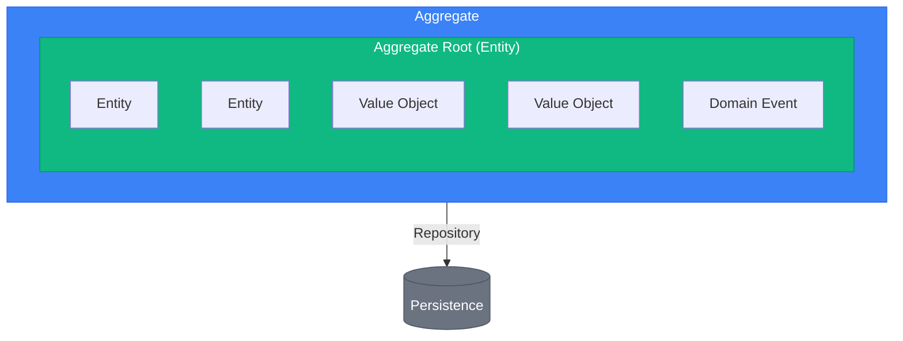
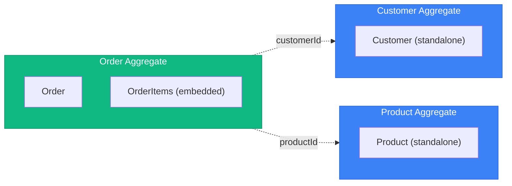
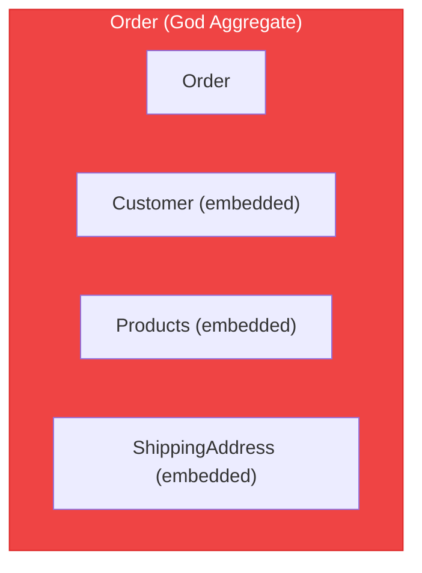

# DDD Tactical Patterns

> Sources:
> - [Domain-Driven Design: The Blue Book](https://www.domainlanguage.com/ddd/blue-book/) — Eric Evans (2003)
> - [Implementing Domain-Driven Design](https://openlibrary.org/works/OL17392277W) — Vaughn Vernon (2013)
> - [Effective Aggregate Design](https://www.dddcommunity.org/library/vernon_2011/) — Vaughn Vernon
> - [Repository Pattern](https://martinfowler.com/eaaCatalog/repository.html) — Martin Fowler (PoEAA)

## Building Blocks Overview



---

## Entity

An object with **identity** that persists through time. Two entities are equal if they have the same identity, regardless of attribute values.

### Characteristics

- Has a unique identifier
- Identity persists through lifecycle
- Can change attributes but remains the same entity
- Contains behavior (not just data)

### Pattern

```
abstract class Entity<ID>:
    id: ID

    equals(other: Entity<ID>) -> bool:
        return this.id == other.id

class OrderItem extends Entity<OrderItemId>:
    productId: ProductId
    quantity: Quantity
    unitPrice: Money

    static create(productId, quantity, unitPrice) -> OrderItem:
        return new OrderItem(
            id: OrderItemId.generate(),
            productId: productId,
            quantity: quantity,
            unitPrice: unitPrice
        )

    increaseQuantity(amount: int):
        this.quantity = this.quantity.add(amount)

    subtotal() -> Money:
        return this.unitPrice.multiply(this.quantity.value)
```

---

## Value Object

An object defined by its **attributes**, not identity. Two value objects are equal if all their attributes are equal.

### Characteristics

- Immutable (no setters)
- No identity
- Equality by value (all attributes)
- Self-validating
- Side-effect-free methods

### Common Value Objects

| Value Object | Attributes | Validation |
|--------------|-----------|------------|
| Money | amount, currency | amount >= 0 |
| Email | address | valid email format |
| Address | street, city, zip, country | required fields |
| DateRange | start, end | start <= end |
| Quantity | value | value > 0 |

### Pattern

```
abstract class ValueObject<Props>:
    props: Props

    equals(other: ValueObject<Props>) -> bool:
        return deepEqual(this.props, other.props)

class Money extends ValueObject<{amount, currency}>:

    static create(amount, currency) -> Money:
        guard: amount >= 0
        guard: currency in SUPPORTED_CURRENCIES
        return new Money({amount, currency})

    static zero(currency = "USD") -> Money:
        return Money.create(0, currency)

    add(other: Money) -> Money:
        guard: this.currency == other.currency
        return Money.create(this.amount + other.amount, this.currency)

    subtract(other: Money) -> Money:
        guard: this.currency == other.currency
        return Money.create(this.amount - other.amount, this.currency)

    multiply(factor: number) -> Money:
        return Money.create(this.amount * factor, this.currency)

class Email extends ValueObject<{value}>:

    static create(email: string) -> Email:
        normalized = email.lowercase().trim()
        guard: isValidEmailFormat(normalized)
        return new Email({value: normalized})

    domain() -> string:
        return this.value.split("@")[1]

class OrderId extends ValueObject<{value}>:

    static generate() -> OrderId:
        return new OrderId({value: generateUUID()})

    static from(value: string) -> OrderId:
        guard: value is not empty
        return new OrderId({value})
```

---

## Aggregate

A cluster of entities and value objects treated as a single unit for data changes. Has a **consistency boundary**.

### Rules

1. **One aggregate root** - Single entry point for all modifications
2. **Reference by ID only** - Aggregates reference others by identity, never by direct object reference
3. **Transaction boundary** - One aggregate per transaction (eventual consistency between aggregates)
4. **Invariants within boundary** - Aggregate ensures its own consistency
5. **Small aggregates** - Prefer smaller over larger

### Aggregate Sizing Heuristics

| Metric | Healthy | Warning | Action |
|--------|---------|---------|--------|
| Entities per aggregate | 1-5 | 6-10 | >10: Split |
| Lines of code (root) | <500 | 500-1000 | >1000: Split |
| Transaction lock time | <100ms | 100-500ms | >500ms: Split |
| Concurrent modification conflicts | Rare | Occasional | Frequent: Split |

**Questions to ask:**
- Can parts be eventually consistent? → Separate aggregates
- Do all parts change together? → Same aggregate
- Are there independent lifecycles? → Separate aggregates

### Design Guidelines

**Good: Small Aggregates**



*Reference by ID only*

**Bad: God Aggregate**



*Too large, too many reasons to change, contention issues*

### Pattern

```
abstract class AggregateRoot<ID> extends Entity<ID>:
    domainEvents: List<DomainEvent> = []
    version: int = 0

    addDomainEvent(event: DomainEvent):
        this.domainEvents.append(event)

    clearDomainEvents():
        this.domainEvents = []

class Order extends AggregateRoot<OrderId>:
    customerId: CustomerId
    items: List<OrderItem> = []
    status: OrderStatus
    shippingAddress: Address | null
    createdAt: DateTime

    static create(customerId: CustomerId) -> Order:
        order = new Order(
            id: OrderId.generate(),
            customerId: customerId,
            status: DRAFT,
            createdAt: now()
        )
        order.addDomainEvent(OrderCreated{orderId, customerId})
        return order

    static reconstitute(id, customerId, items, status, ...) -> Order:
        order = new Order(...)
        return order

    addItem(productId, quantity, unitPrice):
        guard: status != CANCELLED
        guard: status != SHIPPED
        guard: quantity > 0

        existingItem = this.items.find(i => i.productId == productId)
        if existingItem:
            existingItem.increaseQuantity(quantity)
        else:
            this.items.append(OrderItem.create(productId, quantity, unitPrice))

        this.addDomainEvent(OrderItemAdded{orderId, productId, quantity})

    removeItem(productId):
        guard: status != CANCELLED
        guard: status != SHIPPED
        guard: item exists

        this.items.remove(productId)
        this.addDomainEvent(OrderItemRemoved{orderId, productId})

    confirm():
        guard: status == DRAFT
        guard: items.length > 0
        guard: shippingAddress != null

        this.status = CONFIRMED
        this.addDomainEvent(OrderConfirmed{orderId, total})

    ship(trackingNumber):
        guard: status == CONFIRMED

        this.status = SHIPPED
        this.addDomainEvent(OrderShipped{orderId, trackingNumber})

    cancel(reason: string):
        guard: status not in [SHIPPED, DELIVERED]

        this.status = CANCELLED
        this.addDomainEvent(OrderCancelled{orderId, reason})

    total() -> Money:
        return this.items.reduce((sum, item) => sum.add(item.subtotal()), Money.zero())

    itemCount() -> int:
        return this.items.reduce((sum, item) => sum + item.quantity.value, 0)
```

---

## Repository

Provides collection-like access to aggregates. Abstracts persistence.

### Rules

1. **One repository per aggregate** - Not per entity or table
2. **Domain interface** - Interface in domain, implementation in infrastructure
3. **Aggregate-focused** - Save/load entire aggregates
4. **No query logic** - Complex queries belong in separate read models

### Pattern

```
interface OrderRepository:
    findById(id: OrderId) -> Order | null
    findByCustomerId(customerId: CustomerId) -> List<Order>
    save(order: Order)
    delete(order: Order)
    nextId() -> OrderId

interface Repository<T extends AggregateRoot<ID>, ID>:
    findById(id: ID) -> T | null
    save(aggregate: T)
    delete(aggregate: T)
```

### Common Mistakes

**Wrong: Repository per entity**

```
interface OrderItemRepository:
    findByOrderId(orderId) -> List<OrderItem>
    save(item: OrderItem)
```

**Wrong: Query methods in repository**

```
interface OrderRepository:
    findByStatus(status) -> List<Order>
    findByDateRange(start, end)
    countByCustomer(customerId)
```

**Correct: Aggregate-focused + separate read model**

```
interface OrderRepository:
    findById(id: OrderId) -> Order | null
    save(order: Order)

interface OrderReadModel:
    findByStatus(status) -> List<OrderSummaryDTO>
    findByDateRange(start, end) -> List<OrderSummaryDTO>
    countByCustomer(customerId) -> int
```

---

## Domain Event

Records something significant that happened in the domain.

### Characteristics

- Immutable
- Past tense naming (`OrderPlaced`, not `PlaceOrder`)
- Contains data needed by consumers
- Timestamp when it occurred

### Pattern

```
abstract class DomainEvent:
    eventId: string = generateUUID()
    occurredAt: DateTime = now()
    abstract eventType: string

    abstract toPayload() -> Map

class OrderCreated extends DomainEvent:
    eventType = "order.created"
    orderId: OrderId
    customerId: CustomerId

    toPayload():
        return {orderId: orderId.value, customerId: customerId.value}

class OrderConfirmed extends DomainEvent:
    eventType = "order.confirmed"
    orderId: OrderId
    total: Money

    toPayload():
        return {orderId: orderId.value, total: {amount, currency}}

class OrderShipped extends DomainEvent:
    eventType = "order.shipped"
    orderId: OrderId
    trackingNumber: TrackingNumber
```

---

## Domain Service

Stateless operations that don't naturally fit within an entity or value object.

### When to Use

- Operation involves multiple aggregates
- Operation requires external information
- Significant business logic that doesn't belong to one entity

### Pattern

```
interface PricingService:
    calculateDiscount(order: Order, customer: Customer) -> Money

class PricingServiceImpl implements PricingService:

    calculateDiscount(order, customer) -> Money:
        discount = Money.zero()

        if order.itemCount() > 10:
            discount = discount.add(order.total().multiply(0.05))

        if customer.isVIP:
            discount = discount.add(order.total().multiply(0.10))

        maxDiscount = order.total().multiply(0.20)
        return min(discount, maxDiscount)

interface ShippingCostCalculator:
    calculate(items: List<OrderItem>, destination: Address) -> Money

class ShippingCostCalculatorImpl implements ShippingCostCalculator:

    calculate(items, destination) -> Money:
        baseRate = Money.create(5.99, "USD")
        perItemRate = Money.create(1.50, "USD")

        total = baseRate.add(perItemRate.multiply(items.length))

        if destination.country != "US":
            total = total.add(Money.create(15.00, "USD"))

        return total
```

---

## Factory

Encapsulates complex aggregate/entity creation.

### When to Use

- Creation logic is complex
- Need to enforce invariants during creation
- Need to create object graphs

### Pattern

```
interface OrderFactory:
    createFromCart(cart: Cart, customer: Customer) -> Order

class OrderFactoryImpl implements OrderFactory:
    pricingService: PricingService

    createFromCart(cart, customer) -> Order:
        guard: not cart.isEmpty

        order = Order.create(customer.id)

        for cartItem in cart.items:
            order.addItem(
                cartItem.productId,
                Quantity.create(cartItem.quantity),
                cartItem.unitPrice
            )

        if customer.defaultAddress:
            order.setShippingAddress(customer.defaultAddress)

        return order
```

---

## Specification Pattern

Encapsulates business rules for querying or validation.

```
interface Specification<T>:
    isSatisfiedBy(candidate: T) -> bool
    and(other: Specification<T>) -> Specification<T>
    or(other: Specification<T>) -> Specification<T>
    not() -> Specification<T>

class OrderOverValueSpec implements Specification<Order>:
    minValue: Money

    isSatisfiedBy(order) -> bool:
        return order.total().amount >= minValue.amount

class OrderHasItemsSpec implements Specification<Order>:

    isSatisfiedBy(order) -> bool:
        return order.items.length > 0

canShipFree = OrderOverValueSpec(Money.create(100, "USD"))
    .and(OrderHasItemsSpec())

if canShipFree.isSatisfiedBy(order):
    applyFreeShipping()
```
